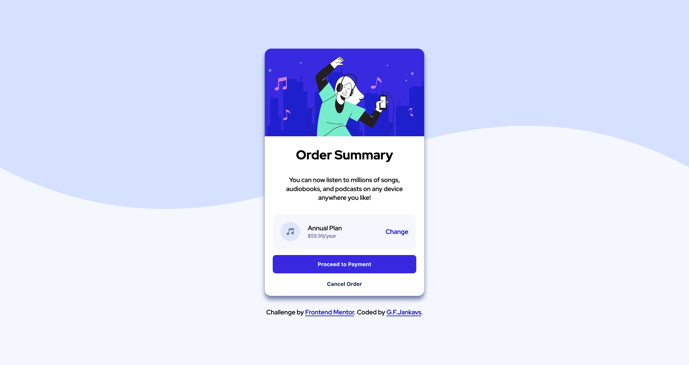
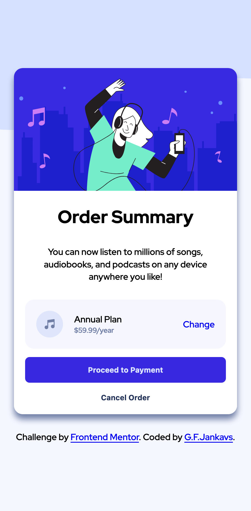

# Frontend Mentor - Order summary card solution

This is a solution to the [Order summary card challenge on Frontend Mentor](https://www.frontendmentor.io/challenges/order-summary-component-QlPmajDUj). Frontend Mentor challenges help you improve your coding skills by building realistic projects. 

## Table of contents

- [Overview](#overview)
  - [The challenge](#the-challenge)
  - [Screenshot](#screenshot)
  - [Links](#links)
- [My process](#my-process)
  - [Built with](#built-with)
  - [What I learned](#what-i-learned)
  - [Continued development](#continued-development)
- [Author](#author)

**Note: Delete this note and update the table of contents based on what sections you keep.**

## Overview

### The challenge

Users should be able to:

- See hover states for interactive elements

### Screenshot

;
;

### Links

- Live Site URL: [Github Pages](https://gfjankavs.github.io/order-summary-component/)

## My process

### Built with

- Semantic HTML5 markup
- CSS
- Flexbox
- JS

### What I learned

This was more of knowledge strengthening exercises rather than challenge where much was learned.

### Continued development

Will make some adjustments to code if necessary based on the comments from other developers.

## Author

- Frontend Mentor - [@GFJankavs](https://www.frontendmentor.io/profile/GFJankavs)
- Twitter - [@GFJankavs](https://www.twitter.com/GFJankavs)
